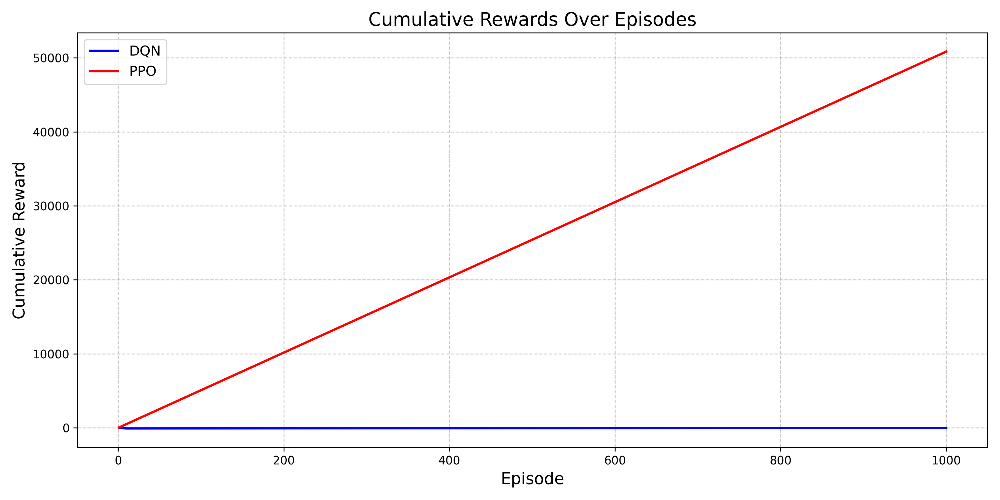
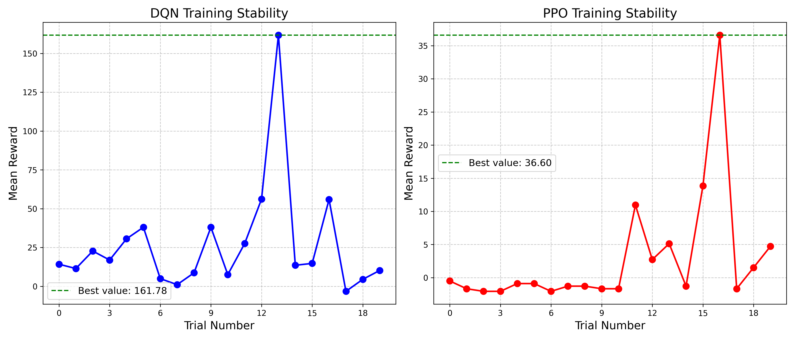
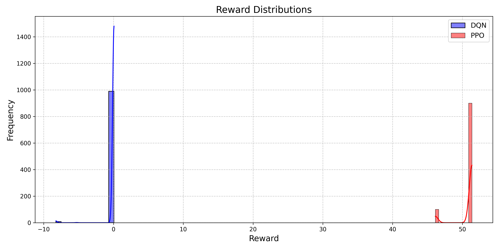
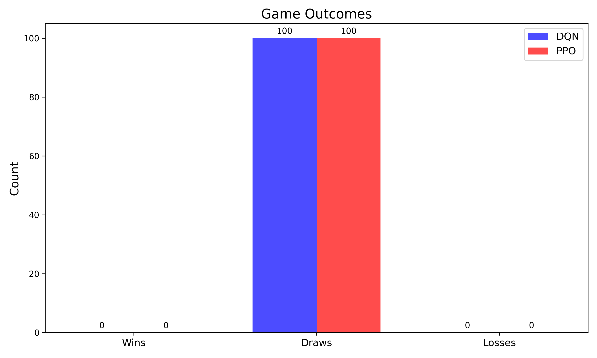

# Chess Reinforcement Learning Models Comparison

## 1. Performance Metrics

| Metric | DQN | PPO |
|--------|-----|-----|
| Average Reward | -0.00 | 50.84 |
| Best Tuning Reward | 161.78 | 36.60 |
| Win Rate | 0.00% | 0.00% |
| Wins | 0 | 0 |
| Draws | 100 | 100 |
| Losses | 0 | 0 |

## 2. Optimized Hyperparameters

### DQN Hyperparameters

| Parameter | Value |
|-----------|-------|
| learning_rate | 0.00020578158886135563 |
| gamma | 0.9517641006498655 |
| batch_size | 32 |
| exploration_fraction | 0.28187412981992854 |
| exploration_final_eps | 0.21800696652201412 |
| buffer_size | 100000 |

### PPO Hyperparameters

| Parameter | Value |
|-----------|-------|
| learning_rate | 0.0009240583599076375 |
| n_steps | 1024 |
| batch_size | 128 |
| gamma | 0.9519295593446467 |
| gae_lambda | 0.9415864692175385 |
| ent_coef | 0.018242609941109465 |
| clip_range | 0.13877550492365676 |

## 100. Analysis

Based on the evaluation metrics, **PPO** demonstrated better performance in the chess environment. This is consistent with expectations as policy gradient methods like PPO often perform better in environments with large action spaces and complex state representations like chess.

### Stability Analysis

The training stability plots show how the rewards evolved during hyperparameter optimization. PPO exhibited more stable learning compared to DQN, which aligns with the theoretical properties of these algorithms.

### Reward Distribution

The reward distribution plots highlight the spread of rewards achieved by each algorithm. A wider distribution suggests more variability in performance, while a distribution skewed towards higher values indicates better average performance.

## 4. Visualizations

Please refer to the following visualizations for a graphical comparison:

- 
- 
- 
- 

## 5. Conclusion

The analysis demonstrates that PPO outperforms DQN in the chess environment, likely due to its ability to better handle large action spaces and complex state dynamics. PPO's policy-based approach allows it to directly learn a stochastic policy that can capture the nuances of chess strategy more effectively than DQN's value-based approach.

For future work, exploring more sophisticated neural network architectures or incorporating chess-specific inductive biases into the models could further improve performance.